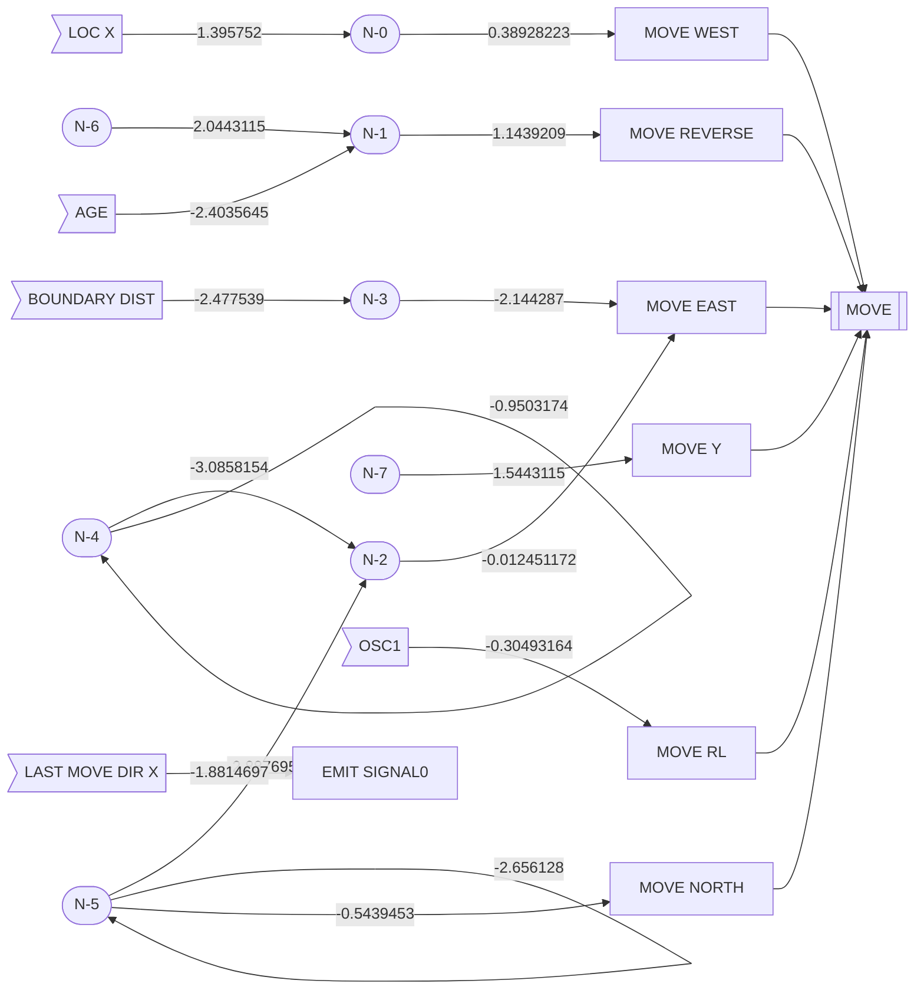

### Graphs

```mermaid
graph LR 
    N00([N-0]) -- 0.38928223 --> W0A[MOVE WEST] 
    N01([N-1]) -- 1.1439209 --> W0F[MOVE REVERSE] 
    N02([N-2]) -- -0.012451172 --> W09[MOVE EAST] 
    N03([N-3]) -- -2.144287 --> W09[MOVE EAST] 
    N04([N-4]) -- -3.0858154 --> N02([N-2]) 
    N04([N-4]) -- -0.9503174 --> N04([N-4]) 
    N05([N-5]) -- -2.8876953 --> N02([N-2]) 
    N05([N-5]) -- -2.656128 --> N05([N-5]) 
    N05([N-5]) -- -0.5439453 --> W0B[MOVE NORTH] 
    N06([N-6]) -- 2.0443115 --> N01([N-1]) 
    N07([N-7]) -- 1.5443115 --> W01[MOVE Y] 
    R00>LOC X] -- 1.395752 --> N00([N-0]) 
    R03>BOUNDARY DIST] -- -2.477539 --> N03([N-3]) 
    R06>LAST MOVE DIR X] -- -1.8814697 --> W08[EMIT SIGNAL0] 
    R0D>OSC1] -- -0.30493164 --> W03[MOVE RL] 
    R0E>AGE] -- -2.4035645 --> N01([N-1]) 
    W0A --> MOVE[[MOVE]] 
    W0F --> MOVE[[MOVE]] 
    W09 --> MOVE[[MOVE]] 
    W0B --> MOVE[[MOVE]] 
    W01 --> MOVE[[MOVE]] 
    W03 --> MOVE[[MOVE]] 
```
