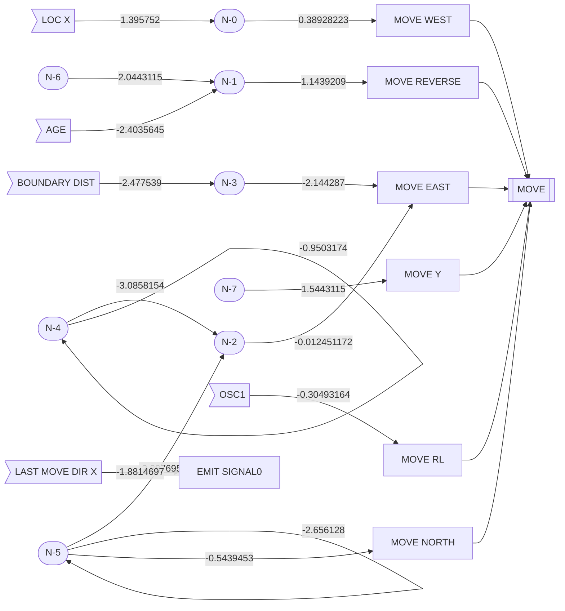
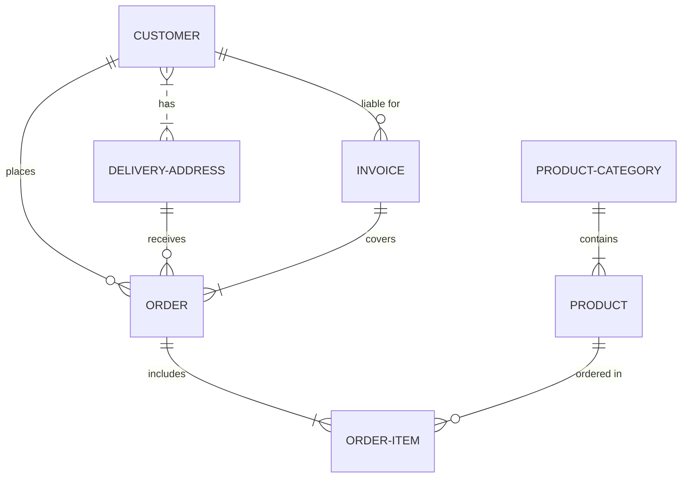
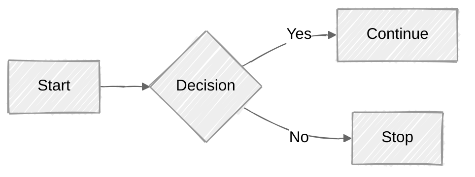
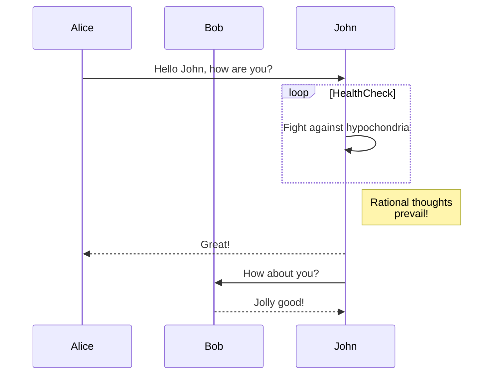
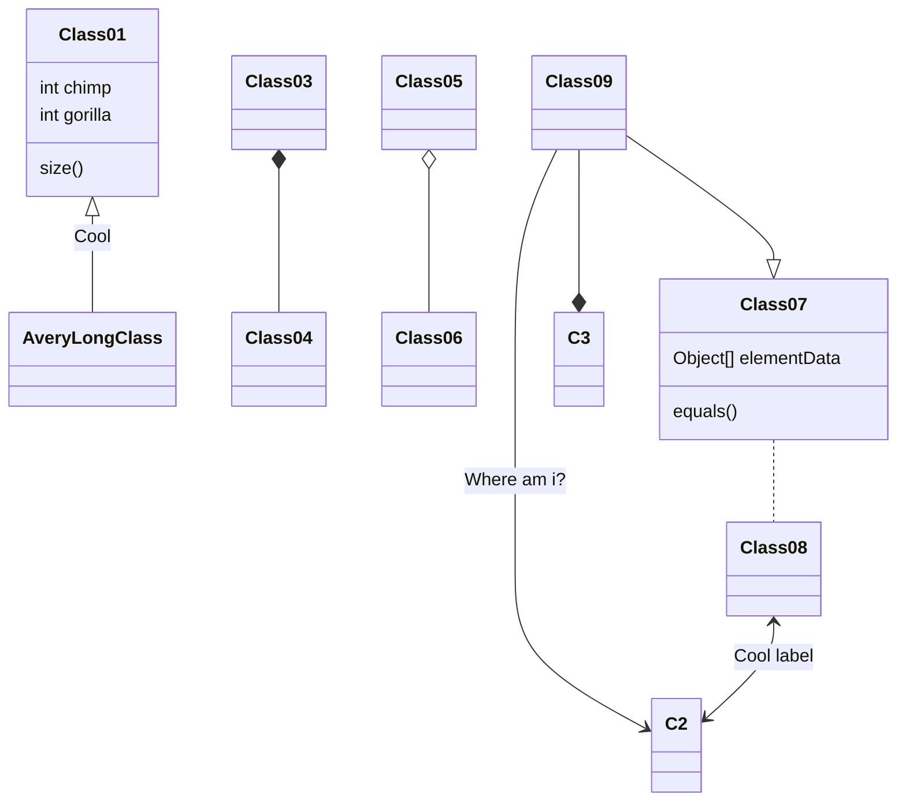
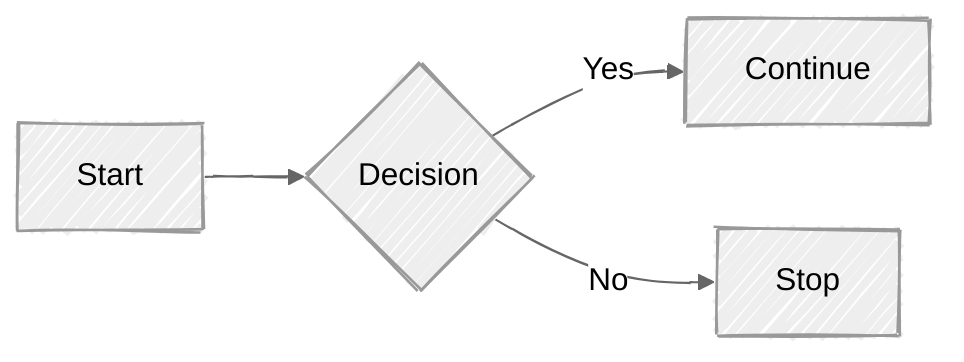

Building Your First .NET Core Applications
=======

In this chapter, we will learn how to setup our development environment,  
create an application, and

When $ a \ne 0 $, there are **two solutions** to $ ax^2 + bx + c = 0 $ and they are $ x = {-b \pm \sqrt{b^2-4ac} \over 2a} $.

### Equation of Pi

$$
\begin{equation}
  \int_0^\infty \frac{x^3}{e^x-1}\,dx = \frac{\pi^4}{15}
  \label{eq:sample}
\end{equation}
$$

How about in a line of text $ \int_0^\infty \frac{x^3}{e^x-1}\,dx = \frac{\pi^4}{15} $?

$$
\displaystyle\sum_{k=3}^5 k^2=3^2 + 4^2 + 5^2 =50
$$

<https://www.upyesp.org/posts/makrdown-vscode-math-notation/>

$$ 
\begin{aligned} 2x - 4 &= 6 \\ 2x &= 10 \\ x &= 5 \end{aligned} 
$$

### Anoucement

```text
 ____              _               _   
|  _ \  ___   __ _| |__   ___ _ __| |_ 
| | | |/ _ \ / _` | '_ \ / _ \ '__| __|
| |_| | (_) | (_| | |_) |  __/ |  | |_ 
|____/ \___/ \__, |_.__/ \___|_|   \__|
             |___/                 
```

### Graphs



```nomnoml
[example|
  propertyA: Int
  propertyB: string
|
  methodA()
  methodB()
|
  [subA]--[subB]
  [subA]-:>[sub C]
]
```
-----------











### Task list
- [ ] Item1
- [x] Item2
- [ ] Item3
- Item4

### Table of Contents

| Tables   |      Are      |  Cool |
|----------|:-------------:|------:|
| col 1 is |  left-aligned | $1,600 |
| col 2 is | centered |   $12 |
| col 3 is | right-aligned |    $1 |
| col 4 is longer | xxx<- long ->xxxx | $123,456 |

----------------

|                     Method |      Median |    StdDev |Scaled |  Gen 0 | Gen 1|    Gen 2|Bytes Allocated/Op |
|--------------------------: |-----------: |---------: |-----: | -----: |-----:|--------:|-----------------: |
|                    Markdig |   5.5316 ms | 0.0372 ms |  0.71 |   56.00| 21.00|    49.00|      1,285,917.31 |
|     CommonMark.NET(master) |   4.7035 ms | 0.0422 ms |  0.60 |  113.00|  7.00|    49.00|      1,502,404.60 |
|CommonMark.NET(pipe_tables) |   5.6164 ms | 0.0298 ms |  0.72 |  111.00| 56.00|    49.00|      1,863,128.13 |
|               MarkdownDeep |   7.8193 ms | 0.0334 ms |  1.00 |  120.00| 56.00|    49.00|      1,884,854.85 |
|                      cmark |   4.2698 ms | 0.1526 ms |  0.55 |       -|     -|        -|                NA |
|                  Moonshine |   6.0929 ms | 0.1053 ms |  1.28 |       -|     -|        -|                NA |
|                  Strike.V8 |  10.5895 ms | 0.0492 ms |  1.35 |       -|     -|        -|                NA |
|                 Marked.NET | 207.3169 ms | 5.2628 ms | 26.51 |    0.00|  0.00|     0.00|    303,125,228.65 |
|              MarkdownSharp | 675.0185 ms | 2.8447 ms | 86.32 |   40.00| 27.00|    41.00|      2,413,394.17 |
|Microsoft DocfxMarkdownLite | 166.3357 ms | 0.4529 ms | 21.27 |4,452.00|948.00|11,167.00|    180,218,359.60 |

### List of items

1. First item
2. Second item
3. Third item
    1. Indented item
    2. Indented item
4. Fourth item

### Image


### Links

My favorite search engine is [Duck Duck Go](https://duckduckgo.com "The best search engine for privacy").

Web site: <https://www.eakin.wtf>  
email: <greg@eakin.wtf>  

- :fire:
- :smiley:
- :t-rex:
- :)
- :angry:
- :question:
- :x:
- :+1:
- :exclamation:
- :rocket:
- :warning:
- :star:
- :zap:
